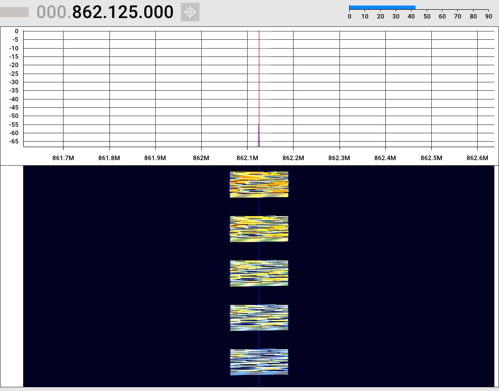
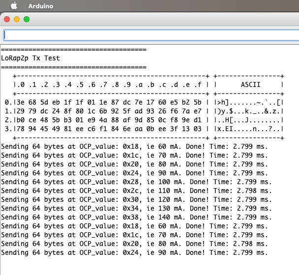

# RAK4631_Advanced_LoRa_P2P_TX

Taken from the original, this sketch demonstrates the importance of OCP, aka Over-Current Protection. By default it is set at 0x18 (24, times 2.5 mA, ie 60 mA), and can be reset up to 0x38, ie 140 mA. The screenshots below show the effect.

The code uses SF 12 and 64 random bytes to make a clear demonstration.

